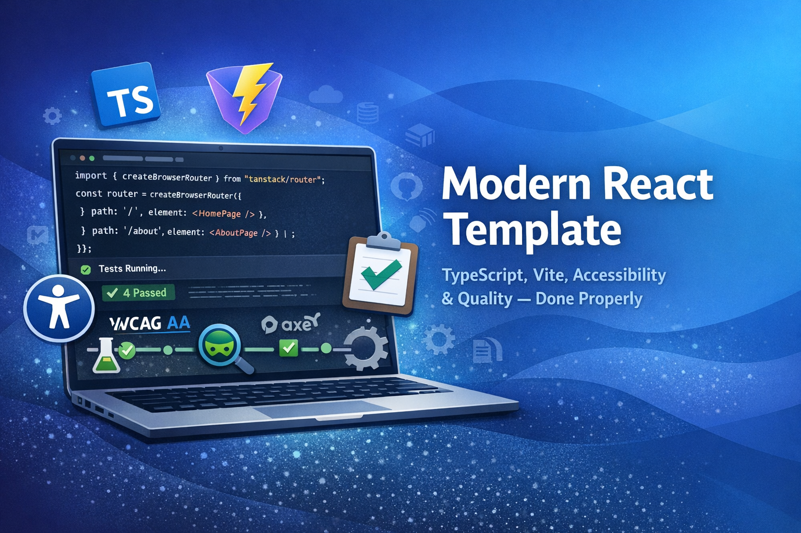

#  Modern React Template

A modern, accessibility-first React 19 application built with Vite 7 and TypeScript 5. This template enforces strict rules for accessibility (WCAG 2.2 AA), performance, and code quality.

[](https://sonarcloud.io/summary/new_code?id=asudbury_modern-react-template)

[](https://sonarcloud.io/summary/new_code?id=asudbury_modern-react-template)
[](https://github.com/asudbury/modern-react-template/actions/workflows/ci.yml) [](https://github.com/asudbury/modern-react-template/actions/workflows/codeql.yml)

> **📘 Fork-Friendly Setup:** This template is designed to work out-of-the-box for forks! All advanced features (CodeQL, SonarCloud, GitHub Pages CI, JSDoc) are **disabled by default** and only run when you explicitly enable them. See [.env.example](./.env.example) for minimal setup instructions.

## Articles


- [YouTube](https://www.youtube.com/watch?v=tZM2NNjjNyE&t=8s)


  [](https://youtu.be/tZM2NNjjNyE?t=8s)


- [Dev.to](https://dev.to/asudbury/modern-react-template-for-2026-4clc)
- [Medium](https://medium.com/@sudburya/modern-react-template-for-2026-b73b4e420b83)
## 🗂️ Google Code Wiki

> A compact, searchable wiki for quick project notes, operational runbooks, diagrams, and short HOWTOs.
>
> [](https://codewiki.google/github.com/asudbury/modern-react-template)

## 📚 DeepWiki Project Knowledge Base

> Explore the full documentation, architecture, and deep technical notes for this project on DeepWiki:
>
> [](https://deepwiki.com/asudbury/modern-react-template)

## SonarCloud
[SonarCloud Dashboard](https://sonarcloud.io/summary/new_code?id=asudbury_modern-react-template)

> ⚠️ **Note for Forks:** The SonarCloud badges above are for the original repository. If you're not using SonarCloud, you can safely remove these badges (lines 3-7).


### Other templates
- There is a lite version available here [modern-react-template-lite](https://github.com/asudbury/modern-react-template-lite)
- There is a mono repo version available here [modern-monorepo-template](https://github.com/asudbury/modern-monorepo-template)

## Features

### Core Features (Always Enabled)
- ♿ [**Accessibility-first**](https://www.w3.org/WAI/WCAG22/quickref/) (WCAG 2.2 AA compliant)
- 🦾 [**Axe-core**](https://github.com/dequelabs/axe-core) automated accessibility checks
- 📝 [**Commitlint**](https://commitlint.js.org/#/) enforcing conventional commit messages
- 🛡️ [**Global Error Boundary**](https://github.com/bvaughn/react-error-boundary) with custom fallback UI and reload/reset support
- 🔒 [**ESLint**](https://eslint.org/) static analysis
- 🪝 [**Husky**](https://typicode.github.io/husky/) pre-commit + commit-msg hooks
- 🧹 [**Knip**](https://knip.dev/) unused code & dependency analysis (non-blocking, see CI)
- 🎭 [**Playwright**](https://playwright.dev/) for E2E browser testing
- 💅 [**Prettier**](https://prettier.io/) code formatting
- ✨ [**React 19**](https://react.dev/) with the latest features
- 🎨 [**Tailwind-like CSS**](https://tailwindcss.com/) utility classes in [index.css](src/index.css)
- 🔄 [**TanStack Query**](https://tanstack.com/query/latest) for server state management
- 🧭 [**TanStack Router**](https://tanstack.com/router) for type-safe routing
- 🌗 [**Theming**](#theming) with light/dark mode and design tokens
- ⚡ [**Vite 7**](https://vite.dev/) — Fast dev server and production build (used for local development, HMR, and building `dist/`)
- 🧪 [**Vitest + React Testing Library**](https://vitest.dev/) unit testing and accessible queries
- 🧑‍⚖️ [**Zod**](https://zod.dev/) for data validation
- 🚫 [**404 Not Found Page**](#404-not-found-page) accessible, customizable fallback for unmatched routes


### Optional Core Features (Disabled by default)
- 🛡️ [**CodeQL**](https://codeql.github.com/docs/) for advanced code scanning and security analysis
- 🌐 [**GitHub Pages**](https://docs.github.com/en/pages) deployment for app and docs
- 🔍 [**SonarCloud**](https://sonarcloud.io/) for continuous code quality analysis
- 📖 [**TypeDoc**](https://typedoc.org/) for automated API documentation


See [Feature Configuration](./FEATURES.md) for a canonical list of optional repository Actions variables (ENABLE_*) and detailed setup instructions for CodeQL, SonarCloud, GitHub Pages, and JSDoc.

### CodeQL (Opt-in)

By default, this repository treats CodeQL scans as opt-out to avoid heavy analysis running automatically on forks and CI. Use one of these methods to run CodeQL:

 - **Run manually:** In GitHub, go to Actions → CodeQL → Run workflow. Ensure the `run_codeql` input is `true`.
 - **Enable automated runs:** Add a repository Variable or Secret named `ENABLE_CODEQL` with value `true` under Settings → Secrets and variables → Actions → Variables (or Secrets). When set to `true`, scheduled/push/PR runs will be allowed.

This matches the workflow gating in `.github/workflows/codeql.yml`.

### SonarCloud Integration (Opt-in)

This template uses SonarCloud for continuous code quality and security analysis. Configuration is driven by environment variables so forks can set up their own SonarCloud projects without editing source files.

**Setup Requirements (for your fork or repo):**
1. Sign up at [SonarCloud](https://sonarcloud.io/)
2. Import **your** repository into SonarCloud and note the generated:
  - Organization key (e.g. `my-org`)
  - Project key (e.g. `my-org_modern-react-template`)
3. Add `SONAR_TOKEN` to your GitHub repository secrets (Project Settings → Security → Tokens in SonarCloud).
4. In your GitHub repository settings, add the following **Actions secrets/variables**:
  - `SONAR_ORGANIZATION` – your SonarCloud organization key
  - `SONAR_PROJECT_KEY` – your SonarCloud project key
  - `SONAR_TOKEN` – the token from SonarCloud
5. (Optional) Go to **Settings → Variables → Actions** in your GitHub repository and create a variable named `ENABLE_SONARCLOUD` with value `true` to enable SonarCloud analysis. Set it to `false` (or remove it) to skip the SonarCloud job.

The `sonar-project.properties` file reads `SONAR_ORGANIZATION` and `SONAR_PROJECT_KEY` at analysis time, so no changes are required in the file when you fork this template.

View your project's quality metrics on the SonarCloud dashboard when analysis is enabled.

### GitHub Pages Deployment (Opt-in)

The template automatically deploys four entry points to GitHub Pages on every push to `main`:

1. **Main Landing Page** – `https://asudbury.github.io/modern-react-template/`
2. **Demo App** – `https://asudbury.github.io/modern-react-template/app`
4. **API Documentation** – `https://asudbury.github.io/modern-react-template/docs`

**Setup Requirements:**
1. Go to repository Settings → Pages
2. Set Source to "GitHub Actions"
3. Push to `main` branch to trigger deployment

**Important:** Deployment only happens from the `main` branch. The workflow automatically configures proper base paths for asset loading.

## Global Error Handling

This template uses a global error boundary to catch unexpected errors anywhere in the React component tree and display a user-friendly fallback UI instead of a blank screen or crash.

- Implemented using [`react-error-boundary`](https://github.com/bvaughn/react-error-boundary)
- Configured in [`src/main.tsx`](src/main.tsx) wrapping the entire app
- Custom fallback UI in [`src/components/ErrorFallback/ErrorFallback.tsx`](src/components/ErrorFallback/ErrorFallback.tsx)
- Users can reload the app or reset the error boundary from the fallback UI


## Quick Start

**Prerequisites:**
- Node.js 20 or higher
- npm (comes with Node.js)

```bash
# Install dependencies
npm install

# Start development server
npm run dev
```

Visit `http://localhost:5173` to see your application.

> 🍴 **Forked this repo?** See [QUICKSTART.md](./QUICKSTART.md) for fork-specific setup instructions. All optional features (SonarCloud, GitHub Pages, etc.) are disabled by default and won't interfere with your fork.

## Routing with TanStack Router

This template uses [TanStack Router](https://tanstack.com/router) for type-safe client-side routing. The router is configured in `src/router.tsx` and integrated into the app via `App.tsx`.

### Navigation

The template includes a `Navigation` component that uses TanStack Router's `Link` component for type-safe navigation:

```tsx
import { Link } from '@tanstack/react-router';

<Link to="/" activeProps={{ className: 'active' }}>
  Home
</Link>
```

### Available Routes

 - `/` - Home page (HomePage component)
 - `*` (any unmatched path) – **404 Not Found page** (NotFoundPage component)

#### 404 Not Found Page

This template includes a fully accessible, customizable 404 Not Found page for unmatched routes. The 404 page:
- Is automatically shown for any route that does not match a defined path
- Uses semantic HTML, design tokens, and is keyboard/screen reader accessible
- Provides a clear message and a link to return home

**Customizing the 404 page:**
- Edit `src/pages/NotFoundPage/NotFoundPage.tsx` to change the message, add illustrations, or update the layout
- The route is configured in `src/router.tsx` with `path: '*'`

**Demo:** On the home page, click the "Demo 404 Not Found page" link to preview the 404 page in the app.

### Adding New Routes

To add a new route, update `src/router.tsx`:

```tsx
import { createRoute } from '@tanstack/react-router';
import { YourComponent } from './pages/YourComponent';

const yourRoute = createRoute({
  getParentRoute: () => rootRoute,
  path: '/your-path',
  component: YourComponent,
});

// Add to routeTree
const routeTree = rootRoute.addChildren([
  indexRoute,
  yourRoute
]);
```

### Type-Safe Navigation

TanStack Router provides full TypeScript autocomplete and type checking for routes:

```tsx
import { Link, useNavigate } from '@tanstack/react-router';

// Link component with autocomplete

// Programmatic navigation
const navigate = useNavigate();
navigate({ to: '/' });
```

For more details, see the [TanStack Router documentation](https://tanstack.com/router/latest/docs/framework/react/overview).


## Available Scripts

### Development
- `npm run dev` - Start development server
- `npm run build` - Build for production (no GitHub Pages side effects)
- `npm run preview` - Preview production build


### Code Quality
- `npm run lint` - Run ESLint
- `npm run lint:fix` - Fix ESLint issues
- `npm run prettier` - Format code with Prettier
- `npm run knip` - Analyze for unused files, exports, and dependencies (see below)
- Conventional commits enforced via commitlint on `git commit`

#### Unused Code & Dependency Analysis (Knip)

This template uses [Knip](https://knip.dev/) to detect unused files, exports, and dependencies:

- Run `npm run knip` locally to see a report of unused code and dependencies
- Knip runs automatically in CI (see the "Knip (Unused Code Analysis)" job)
- **Knip is non-blocking:** CI and deployments will never fail due to Knip findings; the report is uploaded as an artifact for maintainers to review
- Use Knip to keep your codebase clean and remove dead code as needed

**Example:**

```bash
npm run knip
# or in CI, download the knip-report artifact for details
```

See [knip.toml](./knip.toml) for configuration details.

### Testing
- `npm run test` - Run unit tests in watch mode
- `npm run test:unit` - Run unit tests
- `npm run test:coverage` - Run unit tests with coverage report
- `npm run test:ui` - Run tests with UI
- `npm run test:e2e` - Run E2E tests with Playwright

### Documentation
- `npm run docs` - Generate both markdown and HTML documentation
- `npm run docs:md` - Generate markdown documentation in `docs/`
- `npm run docs:html` - Generate HTML documentation in `docs-html/`

### GitHub Pages (Optional)
- `npm run update:gh-page-details` - Inject `package.json` version into a copy of `public/gh-pages-index.html` and write it to `dist/gh-pages-index.html` (used for GitHub Pages landing page)
- `npm run build:gh-pages` - Build the app and, when `ENABLE_GH_PAGES=true`, generate GitHub Pages artifacts (including `dist/gh-pages-index.html`)

### Repository Customization
- `npm run cleanup` - Interactive script to remove optional features and customize the template to your needs

> **🧹 Cleanup Tool:** Use `npm run cleanup` to interactively remove features you don't need (Playwright, commitlint, SonarCloud, TypeDoc, GitHub Pages, etc.). This helps you start with a minimal setup tailored to your project. See [scripts/README.md](./scripts/README.md) for details.

## Project Structure

```

modern-react-template/
├── .github/
│   ├── workflows/
│   │   ├── ci.yml              # CI/CD pipeline
│   │   ├── codeql.yml          # CodeQL security scanning (opt-in)
│   │   ├── sonarcloud.yml      # SonarCloud analysis (opt-in)
│   │   └── pages.yml           # GitHub Pages deployment (opt-in)
│   └── copilot-instructions.md # Copilot coding guidelines
├── .husky/
│   └── pre-commit              # Pre-commit hooks
│   └── pre-commit-secrets      # Pre-commit secrets hooks
├── docs/                       # Generated markdown docs (TypeDoc)
├── docs-html/                  # Generated HTML docs (TypeDoc)
├── knip.toml                   # Knip configuration (unused code analysis)
├── playwright/                 # UI tests
├── src/
│   ├── components/             # Reusable UI components and samples
│   │   ├── Button/             # Button component (+ tests, stories, index)
│   │   ├── Navigation/         # Navigation bar
│   │   ├── ErrorFallback/      # Global error fallback for error boundary
│   ├── pages/                  # Route/page components
│   ├── queries/                # Data fetching/mutations (TanStack Query)
│   ├── schemas/                # Zod schemas and types
│   ├── test/                   # Test setup/mocks
│   ├── App.tsx                 # Root app component
│   ├── main.tsx                # Entry point (includes error boundary)
│   ├── router.tsx              # Router config
│   └── index.css               # Global styles
├── .env.example                # Environment variables template
├── .gitignore                  # Git ignore rules
├── .gitleaks.toml              # Secret scanning config (Gitleaks)
├── .gitleaksignore             # Secret scanning ignore rules
├── .prettierrc                 # Prettier configuration
├── eslint.config.js            # ESLint configuration
├── package.json                # Dependencies and scripts
├── playwright.config.ts        # Playwright configuration
├── sonar-project.properties    # SonarCloud configuration
├── tsconfig.json               # TypeScript configuration
├── typedoc.json                # TypeDoc markdown config
├── typedoc.html.json           # TypeDoc HTML config
├── vite.config.ts              # Vite configuration
└── vitest.config.ts            # Vitest configuration
```

## Documentation

This template generates comprehensive documentation in multiple formats:

### Markdown Documentation (`docs/`)

The `docs/` directory contains auto-generated markdown documentation from TypeDoc. This is committed to the repository and provides developer-friendly API documentation.

```bash
npm run docs:md
```

### HTML Documentation (GitHub Pages)

HTML documentation is automatically generated and deployed to GitHub Pages:
- **API Docs**: [https://asudbury.github.io/modern-react-template/docs](https://asudbury.github.io/modern-react-template/docs)
- **Demo App**: [https://asudbury.github.io/modern-react-template/app](https://asudbury.github.io/modern-react-template/app)

## Sample Implementations

This template ships with several concrete samples you can use as references:

- **Home page layout**: `src/pages/HomePage/HomePage.tsx` demonstrates accessible page structure and headings.
- **Reusable component + tests**: `src/components/Button/` includes the button implementation and unit tests
- **Data fetching utilities**: `src/queries/fetch.ts` and `src/queries/mutate.ts` show how to use TanStack Query with Zod validation.
- **E2E + accessibility test**: `playwright/homepage.spec.ts` is a full Playwright + axe-core example for the home page.
- **Generated API docs**: `docs/` and `docs-html/` contain TypeDoc output you can browse as living samples of the project APIs.


### Pre-commit Hooks

Husky enforces code quality on every commit:
1. Format code with Prettier
2. Run unit tests
3. Lint with ESLint
4. Build the project

If any of these checks fails, the commit is blocked and the corresponding
command's error output is shown in your terminal (for example ESLint errors
or failing tests). Fix the reported issues and re-run `git commit`.

Additionally, a Husky `commit-msg` hook runs **commitlint** to enforce
[Conventional Commits](https://www.conventionalcommits.org/) for commit
messages. Example:

```text
feat: add a new component
fix: handle invalid user IDs in updateUser
chore: configure commitlint for commit messages
```

### GitHub Actions Variables (Optional Builds)

Optional build steps for GitHub Pages are controlled via **repository-level
Actions variables**, not committed to the repo. Configure them at:

https://github.com/asudbury/modern-react-template/settings/variables/actions


## Theming

This template supports accessible theming with light and dark modes, powered by design tokens and utility classes in `src/index.css`.

### Features
- Light and dark mode support out of the box
- Uses CSS custom properties (design tokens) for colors, spacing, and typography
- Theme toggle button included (see `ThemeToggleButton` component)
- All components use tokenized styles for full theme compatibility

### How to Use
- The app automatically detects system theme preference and applies it
- Users can toggle theme manually using the theme toggle button in the UI
- To customize themes, edit `src/index.css`

For more, see the `ThemeToggleButton` for reference.

---

## Key Conventions

### Accessibility

- Every component is keyboard-navigable
- Screen reader friendly with proper ARIA attributes
- WCAG 2.2 AA compliant
- Color contrast ratios meet minimum requirements
- Automated accessibility testing with Axe

### Code Style

- **No inline JSX handlers** - Use `useCallback` or named functions
- **Named exports** - No default exports for components
- **Design tokens only** - No hardcoded colors or spacing
- **Strict TypeScript** - All code must be fully typed
- **Zod validation** - All external data must be validated
- **JSDoc documentation** - All exported functions, components, and types must have JSDoc comments

### JSDoc Documentation

All public APIs (exported functions, components, types) should optionally include JSDoc comments:

```tsx
/**
 * Button Component
 *
 * An accessible button component following WCAG 2.2 AA guidelines.
 *
 * @example
 * ```tsx
 * <Button variant="primary" onClick={handleClick}>
 *   Click me
 * </Button>
 * ```
 */
export function Button({ variant = 'primary', ...props }: ButtonProps) {
  // Implementation
}

```

### Testing

- **Unit tests** - Use Vitest + React Testing Library
- **Query by role** - Use accessible queries (`getByRole`, `getByLabelText`)
- **User events** - Use `userEvent.setup()`, never `fireEvent`
- **E2E tests** - Use Playwright with Axe accessibility checks

```

## Environment Variables

Create a `.env` file based on `.env.example`:

```bash
cp .env.example .env
```

All environment variables must be prefixed with `VITE_` to be exposed to the client.

For local tooling and CI toggles, additional variables are defined in
`.env.example` (not exposed to the client), including:

- `SONAR_ORGANIZATION`, `SONAR_PROJECT_KEY`, `SONAR_TOKEN` – SonarCloud config
- `ENABLE_SONARCLOUD` – enable/disable SonarCloud in CI
- `SKIP_COMMITLINT` – set to `true` to temporarily skip commit message
  linting enforced by Husky + commitlint

## CI/CD Pipeline

The CI pipeline runs on every push and pull request:

1. **Lint** - ESLint checks
2. **Format** - Prettier checks
3. **Test** - Unit tests with Vitest
4. **Build** - Production build
5. **E2E** - Playwright tests with Axe accessibility scans

### CI cache notes

This repository's GitHub Actions workflows cache npm and build artifacts to
speed CI runs. Common ways to inspect and control caches:

- Inspect Actions job logs for cache messages like `Cache restored from key:`
  (cache hit) or `Cache not found for input key:` (cache miss).
- To force-refresh caches, update `package-lock.json` (recommended) so
  lockfile-based cache keys change, or temporarily change the workflow
  cache key (not recommended long-term).
- Example cache keys used in workflows:
  - npm cache: `${{ runner.os }}-node-${{ hashFiles('**/package-lock.json') }}`
  - Vite cache: `${{ runner.os }}-vite-${{ hashFiles('**/package-lock.json') }}-${{ hashFiles('**/vite.config.ts') }}`

If you want help verifying a cache hit/miss on a recent Actions run, tell me
which run and I can point to the relevant log lines.

## Pre-commit Hooks

Husky runs the following checks on every commit:

1. Format code with Prettier
2. Run unit tests
3. Lint with ESLint
4. Build the project

If any check fails, the commit is blocked.

### Pre-commit secret scanning

This repository includes local and CI secret scanning using `gitleaks`.

- Local npm scripts (defined in `package.json`):

```bash
# Full repo scan
npm run secrets:scan

# Scan only staged changes (good for pre-commit hooks)
npm run secrets:scan-staged

# Create/update baseline report
npm run secrets:baseline
```

- To enable blocking secret checks locally, add `npm run secrets:scan-staged` to your Husky `pre-commit` hook (or run it manually before committing). CI still runs a full scan via the `secret-scan` job.

## Extending the Template

This template is designed to be extensible. See [EXTENSIONS.md](./EXTENSIONS.md) for comprehensive guides on:

- 🎨 **TypeDoc Custom Theming** - Customize documentation appearance
- 📊 **Error Logging Frameworks** - Sentry, LogRocket, Rollbar integration
- 🔌 **Plug-and-Play Options** - Radix UI, Headless UI, React Hook Form
- 🏗️ **Infrastructure as Code** - AWS CDK, Terraform, Pulumi guides
- 🛠️ **Extensibility Scripts** - Component generators and scaffolding tools
- ☁️ **Cloud Deployments** - AWS, Azure, GCP, Vercel, Netlify guides
- 💡 **Additional Features** - Authentication, i18n, analytics, monitoring

## Contributing

1. Follow the coding conventions outlined in this README
2. Write tests for all new features
3. Ensure accessibility compliance
4. Run all checks before committing
5. Keep PRs small and focused


## License

MIT

## Resources

### Core Framework & Styling

- [React 19 Documentation](https://react.dev)
- [TypeScript Documentation](https://www.typescriptlang.org/docs/)
- [Vite Documentation](https://vite.dev)

### Data, Validation & Accessibility

- [Accessibility (WCAG 2.2 AA)](https://www.w3.org/WAI/WCAG22/quickref/)
- [Axe-core](https://www.deque.com/axe/devtools/)
- [TanStack Query Documentation](https://tanstack.com/query/latest)
- [Zod](https://zod.dev/)

### Testing

- [Playwright Documentation](https://playwright.dev)
- [React Testing Library](https://testing-library.com/docs/react-testing-library/intro/)
- [Vitest Documentation](https://vitest.dev)


### Linting, Formatting & Git Hooks

- [Commitlint](https://commitlint.js.org/#/)
- [ESLint](https://eslint.org/)
- [Husky](https://typicode.github.io/husky/)
- [Knip](https://knip.dev/) 
- [Prettier](https://prettier.io/)


### Docs, Analysis & Hosting

- [GitHub Pages](https://docs.github.com/en/pages)
- [SonarCloud](https://sonarcloud.io/)
- [CodeQL](https://codeql.github.com/docs/)
- [TypeDoc](https://typedoc.org/)
