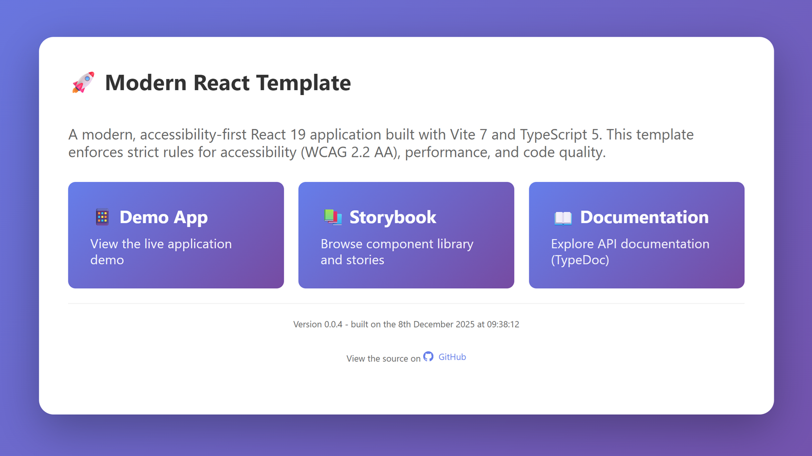

# Modern React Template

> **📘 Fork-Friendly Setup:** This template is designed to work out-of-the-box for forks! All advanced features (SonarCloud, GitHub Pages, Storybook CI, JSDoc) are **disabled by default** and only run when you explicitly enable them. See [QUICKSTART.md](./QUICKSTART.md) for minimal setup instructions.

[](https://sonarcloud.io/summary/new_code?id=asudbury_modern-react-template)

[](https://sonarcloud.io/summary/new_code?id=asudbury_modern-react-template)

[SonarCloud Dashboard](https://sonarcloud.io/summary/new_code?id=asudbury_modern-react-template)

> ⚠️ **Note for Forks:** The SonarCloud badges above are for the original repository. If you're not using SonarCloud, you can safely remove these badges (lines 3-7).

A modern, accessibility-first React 19 application built with Vite 7 and TypeScript 5. This template enforces strict rules for accessibility (WCAG 2.2 AA), performance, and code quality.



## Quick Links

- 🚀 **[Quick Start for Forks](./QUICKSTART.md)** - Get started in 5 minutes
- ⚙️ **[Feature Configuration](./FEATURES.md)** - Enable/disable optional features
- 📖 **[Detailed Setup Guide](./SETUP.md)** - Configure optional features (SonarCloud, GitHub Pages, etc.)
- 🔌 **[Extension Options](./EXTENSIONS.md)** - Add-ons, integrations, and deployment guides
- 🤝 **[Contributing Guide](./CONTRIBUTING.md)** - Development guidelines

## Features

### Core Features (Always Enabled)
- ✨ [**React 19**](https://react.dev/) with the latest features
- ⚡ [**Vite 7**](https://vite.dev/) for lightning-fast development
- 📘 [**TypeScript 5**](https://www.typescriptlang.org/docs/) with strict mode enabled
- 🎨 [**Tailwind CSS**](https://tailwindcss.com/docs) with design tokens
- 🧩 [**shadcn/ui**](https://ui.shadcn.com/) components (Card, Badge, Alert, and more)
- ♿ [**Accessibility-first**](https://www.w3.org/WAI/WCAG22/quickref/) (WCAG 2.2 AA compliant)
- 🔄 [**TanStack Query**](https://tanstack.com/query/latest) for server state management
- 🎯 [**React Context + Reducers**](https://react.dev/learn/passing-data-deeply-with-context) for client state
- 🧪 [**Vitest**](https://vitest.dev/) + [**React Testing Library**](https://testing-library.com/docs/react-testing-library/intro/) for unit tests
- 🎭 [**Playwright**](https://playwright.dev/) + [**axe-core**](https://www.deque.com/axe/devtools/) for E2E accessibility testing
- 🔒 [**ESLint**](https://eslint.org/) + [**Prettier**](https://prettier.io/) configuration
- 🪝 [**Husky**](https://typicode.github.io/husky/) pre-commit + commit-msg hooks
- 📝 [**Commitlint**](https://commitlint.js.org/#/) enforcing conventional commit messages
- 🔐 [**Zod**](https://zod.dev/) validation for all external data

### Optional Features (Opt-In, Disabled by Default)
- 📚 [**Storybook**](https://storybook.js.org/) for component development and documentation
- 📖 [**TypeDoc**](https://typedoc.org/) for automated API documentation
- 🔍 [**SonarCloud**](https://sonarcloud.io/) for continuous code quality analysis
- 🌐 [**GitHub Pages**](https://docs.github.com/en/pages) deployment for app, Storybook, and docs

> 💡 **Tip:** Optional features won't run unless you explicitly enable them. See [QUICKSTART.md](./QUICKSTART.md) to learn which features to enable for your use case.

## Quick Start

### Prerequisites

- Node.js 20 or higher
- npm (comes with Node.js)

### Installation

```bash
# Clone the repository
git clone <your-repo-url>
cd modern-react-template

# Install dependencies
npm install

# Start development server
npm run dev
```

Visit `http://localhost:5173` to see your application.

> 🍴 **Forked this repo?** See [QUICKSTART.md](./QUICKSTART.md) for fork-specific setup instructions. All optional features (SonarCloud, GitHub Pages, etc.) are disabled by default and won't interfere with your fork.

## For Forks: What's Enabled by Default?

This template is designed to be **fork-friendly**. Here's what works out of the box:

### ✅ Enabled by Default (No Configuration Needed)
- React 19 development with Vite
- TypeScript with strict mode
- Tailwind CSS with design tokens
- ESLint + Prettier
- Husky pre-commit hooks
- Commitlint for commit messages
- Unit tests with Vitest
- E2E tests with Playwright
- Storybook (local development only)
- TypeDoc (local generation only)

### ❌ Disabled by Default (Opt-In Only)
- **SonarCloud Analysis** - Requires `RUN_SONARCLOUD=true` + configuration
- **GitHub Pages Deployment** - Requires `ENABLE_GH_PAGES=true` + configuration
- **Storybook in CI** - Requires `ENABLE_STORYBOOK_BUILD=true`
- **TypeDoc in CI** - Requires `ENABLE_JSDOC_BUILD=true`

**No workflows will fail on your fork!** Disabled features simply won't run. See [QUICKSTART.md](./QUICKSTART.md) to enable features you want.

## Available Scripts

### Development
- `npm run dev` - Start development server
- `npm run build` - Build for production (no GitHub Pages side effects)
- `npm run preview` - Preview production build

### Code Quality
- `npm run lint` - Run ESLint
- `npm run lint:fix` - Fix ESLint issues
- `npm run prettier` - Format code with Prettier
 - Conventional commits enforced via commitlint on `git commit`

### Testing
- `npm run test` - Run unit tests in watch mode
- `npm run test:unit` - Run unit tests
- `npm run test:ui` - Run tests with UI
- `npm run test:e2e` - Run E2E tests with Playwright

### Storybook
- `npm run storybook` - Start Storybook dev server at http://localhost:6006
- `npm run build-storybook` - Build static Storybook (CI/Pages builds are optional via `ENABLE_STORYBOOK_BUILD`)

### Documentation
- `npm run docs` - Generate both markdown and HTML documentation
- `npm run docs:md` - Generate markdown documentation in `docs/`
- `npm run docs:html` - Generate HTML documentation in `docs-html/`

### GitHub Pages (Optional)
- `npm run update:gh-version` - Inject `package.json` version into a copy of `public/gh-pages-index.html` and write it to `dist/gh-pages-index.html` (used for GitHub Pages landing page)
- `npm run build:gh-pages` - Build the app and, when `ENABLE_GH_PAGES=true`, generate GitHub Pages artifacts (including `dist/gh-pages-index.html`)

## Project Structure

```
modern-react-template/
├── .github/
│   ├── workflows/
│   │   ├── ci.yml             # CI/CD pipeline
│   │   ├── sonarcloud.yml     # SonarCloud analysis
│   │   └── pages.yml          # GitHub Pages deployment
│   └── copilot-instructions.md # Copilot coding guidelines
├── .storybook/
│   ├── main.ts                # Storybook configuration
│   └── preview.ts             # Storybook preview config
├── .husky/
│   └── pre-commit             # Pre-commit hooks
├── docs/                      # Generated markdown docs (TypeDoc)
├── playwright/
│   └── homepage.spec.ts       # E2E tests
├── src/
│   ├── components/            # Reusable UI components
│   │   └── Button/
│   │       ├── Button.tsx
│   │       ├── Button.test.tsx
│   │       ├── Button.stories.tsx
│   │       └── index.ts
│   ├── context/               # React Context for client state
│   │   └── AppContext.tsx
│   ├── pages/                 # Page components
│   │   └── HomePage/
│   ├── queries/               # TanStack Query functions
│   │   ├── fetch.ts
│   │   └── mutate.ts
│   ├── schemas/               # Zod schemas
│   │   └── api.ts
│   ├── styles/                # Design tokens and styles
│   │   └── tokens.css
│   ├── test/                  # Test setup
│   │   └── setup.ts
│   ├── utils/                 # Utility functions
│   ├── App.tsx                # Root component
│   ├── main.tsx               # Entry point
│   └── index.css              # Global styles
├── .env.example               # Environment variables template
├── .gitignore                 # Git ignore rules
├── .gitleaksignore            # Secret scanning ignore rules
├── .prettierrc                # Prettier configuration
├── eslint.config.js           # ESLint configuration
├── package.json               # Dependencies and scripts
├── playwright.config.ts       # Playwright configuration
├── postcss.config.js          # PostCSS configuration
├── sonar-project.properties   # SonarCloud configuration
├── tailwind.config.ts         # Tailwind configuration
├── tsconfig.json              # TypeScript configuration
├── typedoc.json               # TypeDoc markdown config
├── typedoc.html.json          # TypeDoc HTML config
├── vite.config.ts             # Vite configuration
└── vitest.config.ts           # Vitest configuration
```

## Documentation

This template generates comprehensive documentation in multiple formats:

### Markdown Documentation (`docs/`)

The `docs/` directory contains auto-generated markdown documentation from TypeDoc. This is committed to the repository and provides developer-friendly API documentation.

```bash
npm run docs:md
```

### HTML Documentation (GitHub Pages)

HTML documentation is automatically generated and deployed to GitHub Pages:
- **API Docs**: [https://asudbury.github.io/modern-react-template/docs](https://asudbury.github.io/modern-react-template/docs)
- **Storybook**: [https://asudbury.github.io/modern-react-template/storybook](https://asudbury.github.io/modern-react-template/storybook)
- **Demo App**: [https://asudbury.github.io/modern-react-template/app](https://asudbury.github.io/modern-react-template/app)

### Storybook

Storybook provides interactive component documentation and development environment:

```bash
# Run locally
npm run storybook

# Build for deployment
npm run build-storybook
```

All UI components should have corresponding `.stories.tsx` files showcasing variants and states.

## Code Quality & Security

### SonarCloud Integration

This template uses SonarCloud for continuous code quality and security analysis. Configuration is driven by environment variables so forks can set up their own SonarCloud projects without editing source files.

**Setup Requirements (for your fork or repo):**
1. Sign up at [SonarCloud](https://sonarcloud.io/)
2. Import **your** repository into SonarCloud and note the generated:
  - Organization key (e.g. `my-org`)
  - Project key (e.g. `my-org_modern-react-template`)
3. Add `SONAR_TOKEN` to your GitHub repository secrets (Project Settings → Security → Tokens in SonarCloud).
4. In your GitHub repository settings, add the following **Actions secrets/variables**:
  - `SONAR_ORGANIZATION` – your SonarCloud organization key
  - `SONAR_PROJECT_KEY` – your SonarCloud project key
  - `SONAR_TOKEN` – the token from SonarCloud
5. (Optional) Go to **Settings → Variables → Actions** in your GitHub repository and create a variable named `RUN_SONARCLOUD` with value `true` to enable SonarCloud analysis. Set it to `false` (or remove it) to skip the SonarCloud job.

The `sonar-project.properties` file reads `SONAR_ORGANIZATION` and `SONAR_PROJECT_KEY` at analysis time, so no changes are required in the file when you fork this template.

View your project's quality metrics on the SonarCloud dashboard when analysis is enabled.

### Pre-commit Hooks

Husky enforces code quality on every commit:
1. Format code with Prettier
2. Run unit tests
3. Lint with ESLint
4. Build the project

If any of these checks fails, the commit is blocked and the corresponding
command's error output is shown in your terminal (for example ESLint errors
or failing tests). Fix the reported issues and re-run `git commit`.

Additionally, a Husky `commit-msg` hook runs **commitlint** to enforce
[Conventional Commits](https://www.conventionalcommits.org/) for commit
messages. Example:

```text
feat: add Tailwind token mapping
fix: handle invalid user IDs in updateUser
chore: configure commitlint for commit messages
```

## GitHub Pages Deployment

The template automatically deploys four entry points to GitHub Pages on every push to `main`:

1. **Main Landing Page** – `https://asudbury.github.io/modern-react-template/`
2. **Demo App** – `https://asudbury.github.io/modern-react-template/app`
3. **Storybook** – `https://asudbury.github.io/modern-react-template/storybook`
4. **API Documentation** – `https://asudbury.github.io/modern-react-template/docs`

**Setup Requirements:**
1. Go to repository Settings → Pages
2. Set Source to "GitHub Actions"
3. Push to `main` branch to trigger deployment

**Important:** Deployment only happens from the `main` branch. The workflow automatically configures proper base paths for asset loading.

### GitHub Actions Variables (Optional Builds)

Optional build steps for GitHub Pages are controlled via **repository-level
Actions variables**, not committed to the repo. Configure them at:

https://github.com/asudbury/modern-react-template/settings/variables/actions

Variables used:

- `ENABLE_GH_PAGES` – generate the versioned landing page (`dist/gh-pages-index.html`)
- `ENABLE_STORYBOOK_BUILD` – build and publish Storybook
- `ENABLE_JSDOC_BUILD` – build and publish HTML API docs (`docs-html/`)

Set these to `true` to enable the corresponding steps in CI/Pages; leave them
unset or `false` (recommended for forks) to skip those builds.

## Key Conventions

### Accessibility

- Every component is keyboard-navigable
- Screen reader friendly with proper ARIA attributes
- WCAG 2.2 AA compliant
- Color contrast ratios meet minimum requirements
- Automated accessibility testing with Axe

### Code Style

- **No inline JSX handlers** - Use `useCallback` or named functions
- **Named exports** - No default exports for components
- **Design tokens only** - No hardcoded colors or spacing
- **Strict TypeScript** - All code must be fully typed
- **Zod validation** - All external data must be validated
- **JSDoc documentation** - All exported functions, components, and types must have JSDoc comments

### JSDoc Documentation

All public APIs (exported functions, components, types) must include JSDoc comments:

```tsx
/**
 * Button Component
 *
 * An accessible button component following WCAG 2.2 AA guidelines.
 *
 * @example
 * ```tsx
 * <Button variant="primary" onClick={handleClick}>
 *   Click me
 * </Button>
 * ```
 */
export function Button({ variant = 'primary', ...props }: ButtonProps) {
  // Implementation
}
```

See `.github/copilot-instructions.md` for detailed JSDoc formatting guidelines.

### Component Guidelines

```tsx
// ✅ Good: Named function with useCallback
const handleClick = useCallback(() => {
  doSomething();
}, [doSomething]);

return <button onClick={handleClick}>Click me</button>;

// ❌ Bad: Inline function
return <button onClick={() => doSomething()}>Click me</button>;
```

### Testing

- **Unit tests** - Use Vitest + React Testing Library
- **Query by role** - Use accessible queries (`getByRole`, `getByLabelText`)
- **User events** - Use `userEvent.setup()`, never `fireEvent`
- **E2E tests** - Use Playwright with Axe accessibility checks

## Design Tokens

All design tokens are defined in `src/styles/tokens.css` and mapped to Tailwind utilities in `tailwind.config.ts`. Always use tokens instead of hardcoded values.

### Color System

- **Primary**: Blue (buttons, links, primary actions)
- **Secondary**: Violet (secondary actions)
- **Accent**: Cyan (highlights, special features)
- **Neutral**: Grayscale (text, backgrounds, borders)
- **Semantic**: Success (green), Warning (amber), Error (red), Info (blue)

### Example Usage

```tsx
// ✅ Good: Using design tokens
<button className="bg-primary text-white hover:bg-primary-hover">
  Click me
</button>

// ❌ Bad: Hardcoded colors
<button className="bg-blue-600 text-white hover:bg-blue-700">
  Click me
</button>
```

## shadcn/ui Components

This template includes pre-configured shadcn/ui components that follow all repository conventions (accessibility, TypeScript, named exports).

> **Note:** shadcn/ui is optional. See [Removing shadcn/ui](#removing-shadcnui) below if you prefer not to use it.

### Available Components

- **Card** - Display content in card layouts with header, content, and footer sections
- **Badge** - Show status indicators, categories, or tags with multiple variants
- **Alert** - Display notifications and callouts with different severity levels

### Using shadcn/ui Components

```tsx
import { Card, CardContent, CardDescription, CardHeader, CardTitle } from '@/components/shadcn';
import { Badge } from '@/components/shadcn';
import { Alert, AlertDescription, AlertTitle } from '@/components/shadcn';

function MyComponent() {
  return (
    <div>
      <Card>
        <CardHeader>
          <CardTitle>Welcome</CardTitle>
          <CardDescription>Get started with shadcn/ui</CardDescription>
        </CardHeader>
        <CardContent>
          <p>Your content here</p>
          <Badge variant="secondary">New</Badge>
        </CardContent>
      </Card>

      <Alert variant="default">
        <AlertTitle>Information</AlertTitle>
        <AlertDescription>
          This is an informational alert.
        </AlertDescription>
      </Alert>
    </div>
  );
}
```

### Adding More Components

To add more shadcn/ui components:
1. Visit [ui.shadcn.com](https://ui.shadcn.com/)
2. Copy the component code
3. Place it in `src/components/shadcn/`
4. Ensure it uses the `cn()` utility from `@/lib/utils`
5. Follow repository conventions (named exports, JSDoc, accessibility)

### Removing shadcn/ui

If you don't want to use shadcn/ui components, follow these steps:

1. **Remove shadcn components directory:**
   ```bash
   rm -rf src/components/shadcn
   ```

2. **Remove the utility helper:**
   ```bash
   rm -rf src/lib
   ```

3. **Remove shadcn dependencies:**
   ```bash
   npm uninstall class-variance-authority clsx tailwind-merge lucide-react
   ```

4. **Remove configuration file:**
   ```bash
   rm components.json
   ```

5. **Update HomePage** to remove shadcn component usage:
   - Remove the import: `import { ... } from '@/components/shadcn';`
   - Remove the "shadcn/ui Components" section from `src/pages/HomePage/HomePage.tsx`

6. **Update documentation:**
   - Remove the shadcn/ui entry from the Features list in this README
   - Remove the shadcn/ui section from this README (lines 390-441)

After removal, rebuild and test your application:
```bash
npm run build
npm run test
```

See [EXTENSIONS.md](./EXTENSIONS.md) for more details on component libraries and extensions.

If a commit is rejected due to an invalid commit message, commitlint prints a
clear error explaining which rule failed (for example, missing `feat:`/`fix:`
prefix or subject line that is too long). In that case, amend your commit
message using:

```bash
git commit --amend
```

and update the message until commitlint passes.

## State Management

### Server State (TanStack Query)

Use TanStack Query for all server data:

```tsx
import { useQuery } from '@tanstack/react-query';
import { fetchPosts } from './queries/fetch';

function MyComponent() {
  const { data, isLoading, error } = useQuery({
    queryKey: ['posts'],
    queryFn: fetchPosts,
  });

  // ...
}
```

### Client State (Context + Reducer)

Use Context + Reducer for client-side state:

```tsx
import { useAppContext } from './context/AppContext';

function MyComponent() {
  const { state, dispatch } = useAppContext();

  const handleClick = useCallback(() => {
    dispatch({ type: 'TOGGLE_SIDEBAR' });
  }, [dispatch]);

  // ...
}
```

## Environment Variables

Create a `.env` file based on `.env.example`:

```bash
cp .env.example .env
```

All environment variables must be prefixed with `VITE_` to be exposed to the client.

For local tooling and CI toggles, additional variables are defined in
`.env.example` (not exposed to the client), including:

- `SONAR_ORGANIZATION`, `SONAR_PROJECT_KEY`, `SONAR_TOKEN` – SonarCloud config
- `RUN_SONARCLOUD` – enable/disable SonarCloud in CI
- `SKIP_COMMITLINT` – set to `true` to temporarily skip commit message
  linting enforced by Husky + commitlint

## CI/CD Pipeline

The CI pipeline runs on every push and pull request:

1. **Lint** - ESLint checks
2. **Format** - Prettier checks
3. **Test** - Unit tests with Vitest
4. **Build** - Production build
5. **E2E** - Playwright tests with Axe accessibility scans

## Pre-commit Hooks

Husky runs the following checks on every commit:

1. Format code with Prettier
2. Run unit tests
3. Lint with ESLint
4. Build the project

If any check fails, the commit is blocked.

## Extending the Template

This template is designed to be extensible. See [EXTENSIONS.md](./EXTENSIONS.md) for comprehensive guides on:

- 🎨 **TypeDoc Custom Theming** - Customize documentation appearance
- 📊 **Error Logging Frameworks** - Sentry, LogRocket, Rollbar integration
- 🔌 **Plug-and-Play Options** - Radix UI, Headless UI, React Hook Form
- 🏗️ **Infrastructure as Code** - AWS CDK, Terraform, Pulumi guides
- 🛠️ **Extensibility Scripts** - Component generators and scaffolding tools
- ☁️ **Cloud Deployments** - AWS, Azure, GCP, Vercel, Netlify guides
- 💡 **Additional Features** - Authentication, i18n, analytics, monitoring

## Contributing

1. Follow the coding conventions outlined in this README
2. Write tests for all new features
3. Ensure accessibility compliance
4. Run all checks before committing
5. Keep PRs small and focused

## Browser Support

This template targets modern browsers with the following minimum versions:

- Chrome/Edge: Latest 2 versions
- Firefox: Latest 2 versions
- Safari: Latest 2 versions

## License

MIT

## Resources

- [React 19 Documentation](https://react.dev)
- [Vite Documentation](https://vite.dev)
- [TypeScript Documentation](https://www.typescriptlang.org/docs/)
- [Tailwind CSS Documentation](https://tailwindcss.com/docs)
- [Accessibility (WCAG 2.2 AA)](https://www.w3.org/WAI/WCAG22/quickref/)
- [TanStack Query Documentation](https://tanstack.com/query/latest)
- [React Context](https://react.dev/learn/passing-data-deeply-with-context)
- [Vitest Documentation](https://vitest.dev)
- [React Testing Library](https://testing-library.com/docs/react-testing-library/intro/)
- [Playwright Documentation](https://playwright.dev)
- [axe-core](https://www.deque.com/axe/devtools/)
- [ESLint](https://eslint.org/)
- [Prettier](https://prettier.io/)
- [Husky](https://typicode.github.io/husky/)
- [Commitlint](https://commitlint.js.org/#/)
- [Zod](https://zod.dev/)
- [Storybook](https://storybook.js.org/)
- [TypeDoc](https://typedoc.org/)
- [SonarCloud](https://sonarcloud.io/)
- [GitHub Pages](https://docs.github.com/en/pages)
